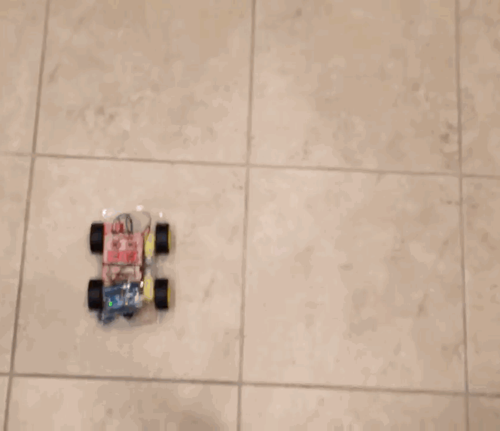
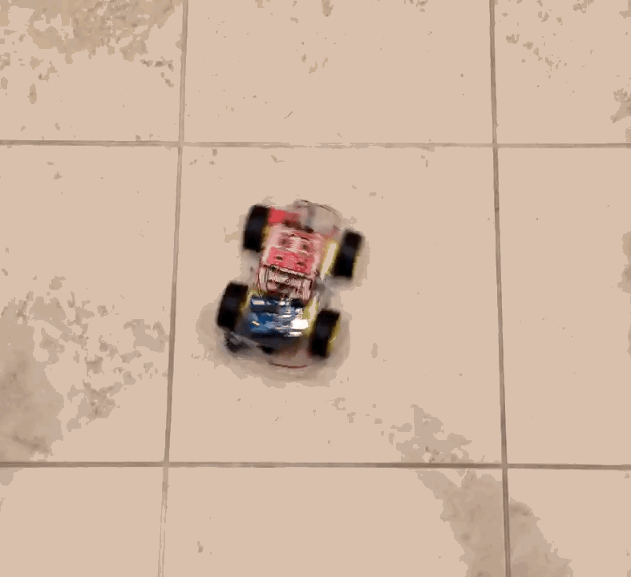
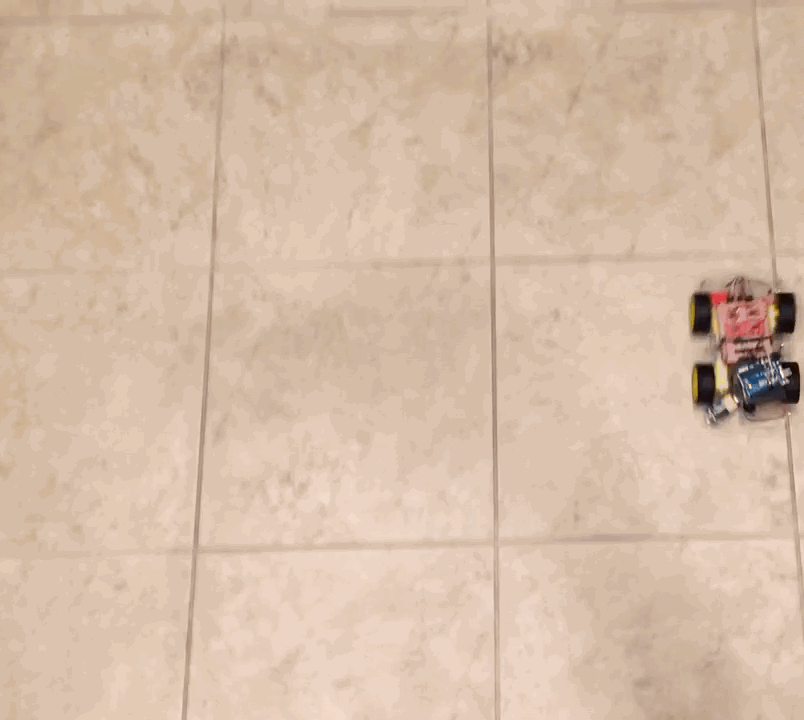
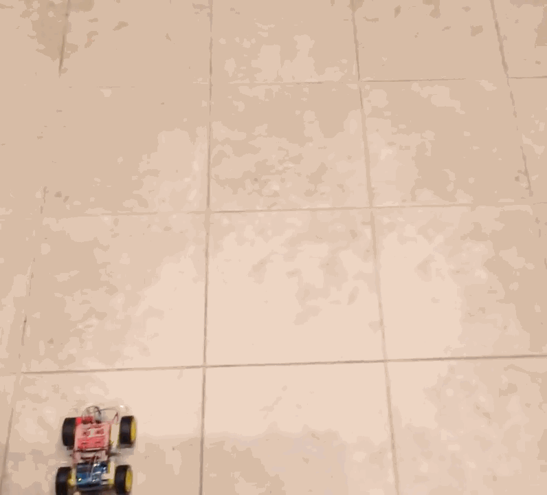

# Carduino





## Square


```cpp
delay = 0.5;

void loop() {
    moveForward();
    turnLeft();
}
```


## Spin


```cpp
delay = 0;

void loop() {
    turnRight();
}
```


## Circle



```cpp
delay = 0.1;

void loop() {
    moveForward();
    turnLeft();
}
```


## Letter "P"



```cpp
delay = 0.5;

moveForward();
moveForward();
moveForward();
turnRight();
moveForward();
moveForward();
turnRight();
moveForward();
turnRight();
moveForward();
turnLeft();
moveForward();
moveForward();
```
